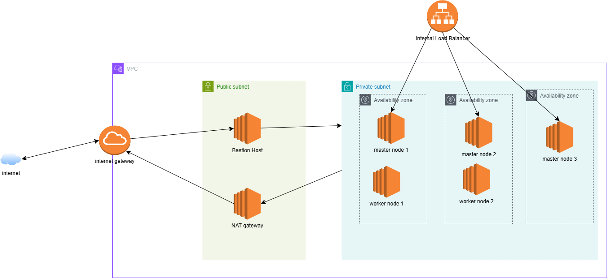

# Distributed Kubernetes Cluster with Fault Tolerance on AWS EC2

This project demonstrates how to set up a highly available, multi-master Kubernetes (K3s) cluster on AWS EC2 instances, deploy a simple Golang application to the cluster, and automate the entire process using Terraform and Ansible.

## Project Overview

The goal of this project is to:
- Deploy a multi-master Kubernetes cluster on EC2 instances using Terraform.
- Set up a distributed etcd service across the master nodes with fault tolerance.
- Deploy a simple Golang app on the Kubernetes cluster.
- Automate the entire setup using Ansible for repeatable and consistent deployments.

---

## Architecture

### Infrastructure Setup
- **AWS EC2 Instances**: Three EC2 instances will be provisioned to act as the master nodes of the Kubernetes cluster.
- **VPC & Networking**: A private subnet is created for secure communication between the EC2 instances. Security groups are configured to allow necessary Kubernetes and etcd traffic.

### Kubernetes Cluster
- **Multi-Master Configuration**: The cluster is set up with three master nodes. Each master runs an instance of the Kubernetes API server and etcd.
- **Fault Tolerance**: The etcd service operates in a distributed cluster using the Raft consensus algorithm, which allows the system to tolerate the failure of one master node.
- **API Server & Etcd Integration**: The API server on each master communicates directly with the etcd instance on the same node, ensuring high availability and automatic leader election if the current leader fails.

### Golang App Deployment
- A simple Golang app is containerized using Docker and deployed on the Kubernetes cluster via Kubernetes Deployment and Service resources.

### Automation
- **Terraform**: Used to provision the EC2 instances and configure networking, ensuring the environment is repeatable and scalable.
- **Ansible**: Used to automate the setup of the Kubernetes cluster and deployment of the Golang app, reducing manual intervention and ensuring consistency.

---

## Prerequisites

Before you begin, ensure you have the following:
- An AWS account with access to EC2 and VPC services.
- Terraform installed (v0.12 or later).
- Ansible installed (v2.9 or later).
- Docker installed for containerizing the Golang app.

---

## Setup Instructions

### Step 1: Provision EC2 Instances with Terraform

1. **Clone the repository**:
   ```bash
   git clone https://github.com/jaycynth/MultiMasterk8s.git
   cd terraform-k8s-cluster
   ```

2. **Configure AWS credentials**:
   Ensure your AWS credentials are set up either in the `~/.aws/credentials` file or as environment variables.

3. **Initialize Terraform**:
   Initialize Terraform to download necessary provider plugins.
   ```bash
   terraform init
   ```

4. **Provision the infrastructure**:
   Apply the Terraform plan to create EC2 instances, VPC, and networking components.
   ```bash
   terraform apply
   ```

   This will provision the 3 EC2 instances to be used as Kubernetes masters. The output will display the public IPs of these instances.

---
### Step 2: Deploy the Golang Application

1. **Write the Golang App**:
   A simple Golang app is included in the `golang-app/` directory. The app exposes a simple HTTP endpoint.

2. **Containerize the App**:
   Build the Docker image for the Golang app:
   ```bash
   cd golang-app
   docker build -t jaycynth/golang-app .
   ```

   Push the image to Docker Hub or your container registry:
   ```bash
   docker push jaycynth/golang-app
   ```

3. **Create Kubernetes Deployment and Service**:
   Apply the Kubernetes Deployment and Service manifests to deploy the app on the cluster:
   ```bash
   kubectl apply -f k8s/deployment.yaml
   kubectl apply -f k8s/service.yaml
   ```

4. **Verify Deployment**:
   Ensure the application is running by checking the pods:
   ```bash
   kubectl get pods
   ```

---

### Step 4: Automate with Ansible

1. **Configure Ansible Inventory**:
   Edit the `inventory.ini` file to include your EC2 instances.

2. **Run Ansible Playbooks**:
   Use Ansible to install K3s, configure the cluster, and deploy the Golang app:
   ```bash
   ansible-playbook -i inventory.ini setup-k3s.yml
   ansible-playbook -i inventory.ini deploy-golang-app.yml
   ```

---

## Fault Tolerance and High Availability

- **Etcd Distributed Cluster**: The etcd service is set up with 3 nodes, utilizing the Raft consensus algorithm to ensure that the cluster can tolerate the failure of one master node.
- **Leader Election**: If the leader node fails, the remaining nodes will automatically elect a new leader.
- **API Server Redirection**: Each master node’s API server communicates with the etcd leader, ensuring high availability for the control plane.

---

## Cleanup

To destroy the infrastructure and clean up all resources:

```bash
terraform destroy
```

---

## Architecture Design




---
## License

This project is licensed under the MIT License - see the [LICENSE](LICENSE) file for details.

---

